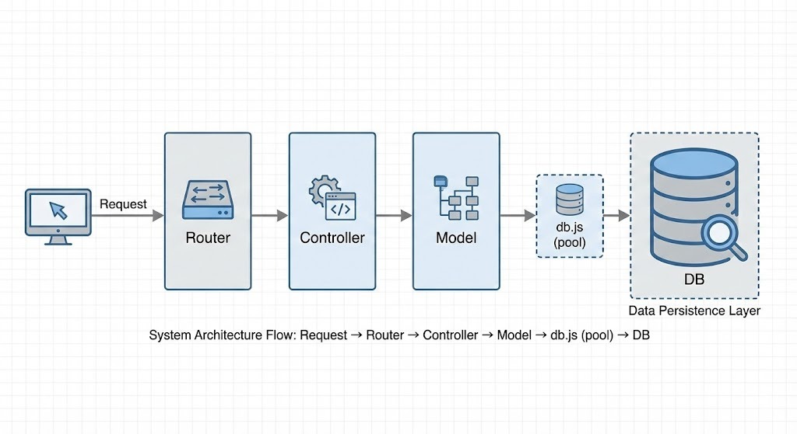
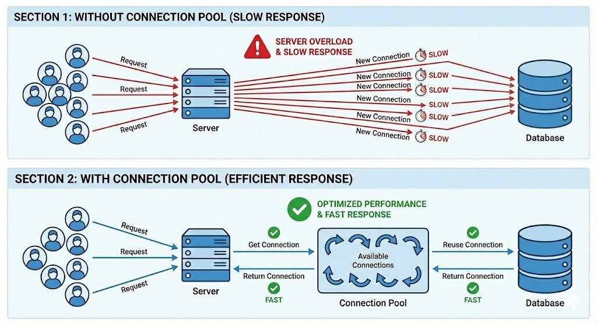
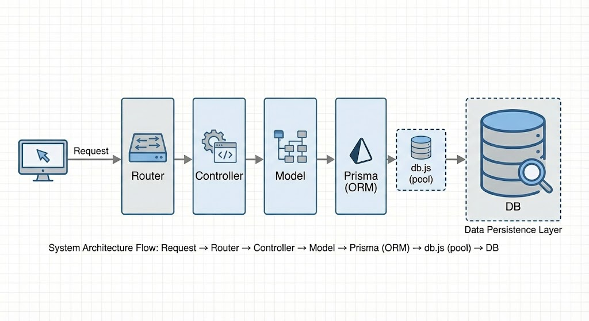

# MySQL

## Chạy MySQL bằng docker

### Cách 1

- Mở terminal/cmd trên máy và chạy lệnh sau để tải image về máy: `docker pull mysql/mysql-server:latest`
- Chạy container: ` docker run --name <container_name> -v mysql-data:/var/lib/mysql -e MYSQL_ROOT_PASSWORD=<your_password> -p 3306:3306 -d mysql/mysql-server:latest`
- Truy cập mysql: `docker exec -it <container_name> mysql -u root -p`

### Cách 2

- Mở terminal/cmd và move tới thư mục `day6_mysql` và chạy: `docker build -t <image-name> .`
- Chạy container: `docker run -d --name <container-name> -p 3306:3306 <image-name>`

## Kiểm tra connection:

- Mở terminal/cmd và chạy `docker exec -it <container-name> bash`
- Sau khi access vào container, chạy câu lệnh: `mysql -h 127.0.0.1 -P 3306 -u root -p`

## Kết nối từ SQL Client - DBeaver

- Tạo connection với thông tin sau:
  - URL: `jdbc:mysql://localhost:3306/testdb?allowPublicKeyRetrieval=true&useSSL=false`
  - Username: `root`
  - Password: `<your-password>`

> **Notes:** `useSSL=false` và `allowPublicKeyRetrieval=true` chỉ nên được sử dụng trong môi trường <u>dev/test</u>. KHÔNG SỬ DỤNG Ở **PRODUCTION**

## Kết nối từ nodeJS

### Install lib

`npm install mysql2`

### Sử dụng mysql2

```javascript
const mysql = require('mysql2');

const connection = mysql.createConnection({
  host: 'localhost',
  user: '<your_username>',
  password: '<your_password>',
  database: '<your_database>',
  port: 3306,
});
connection.connect((err) => {
  if (err) {
    console.log(err);
  }
  console.log('Connected to MySQL database!');
});
```

### Usage

```javascript
connection.query('SELECT * FROM users', (err, results) => {
  if (err) {
    console.log(err);
  }
  console.log(results);
  connection.end();
});
```

## Cải thiện hiệu suất với connection pool

```javascript
const mysql = require('mysql2/promise');

const db = mysql.createPool({
  host: 'localhost',
  user: 'root',
  password: 'rootpassword',
  database: 'testdb',
});

module.exports = db;
```
## Clean architecture


## Sử dụng ORM - Prisma


### Định nghĩa


### So sánh với raw SQL


### Install lib
`npm install prisma @prisma/client @prisma/adapter-mariadb`

### Check lib
`npx prisma`

### Migrate database
`npx prisma init --datasource-provider mysql`

### Pull database
`npx prisma db pull`

### Init prisma client
`npx prisma generate`

### Tại sao vừa có `DATABASE_URL` ở config và adapter ở client
Dùng để tách biệt user:
- `prisma.config` sẽ cấu hình user có quyền chỉnh sửa migration
- `adapter` ở client sẽ cấu hình user chỉ có quyền đọc và ghi dữ liệu (không có quyền chỉnh sửa cấu trúc)

### Migration database
- `npx prisma migrate dev --name some_change`: apply migration
- `npx prisma migrate dev --name some_change --create-only`: chỉ tạo migration chưa apply

### Khác nhau giữa `migrate dev` và `migrate deploy`
- `migrate dev`: vừa **tạo migration** vừa **chạy migration** + hỗ trợ detect drift, nên chỉ dùng ở local/dev.
- `migrate deploy`: chỉ deploy migration đã có sẵn, không detect drift, cũng không reset database